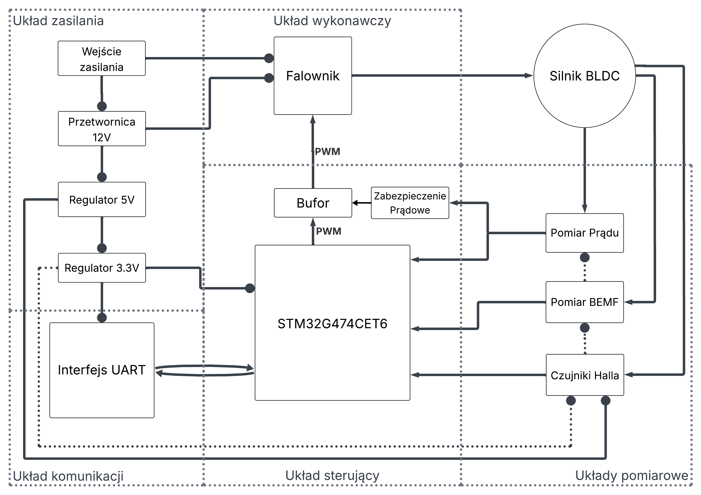
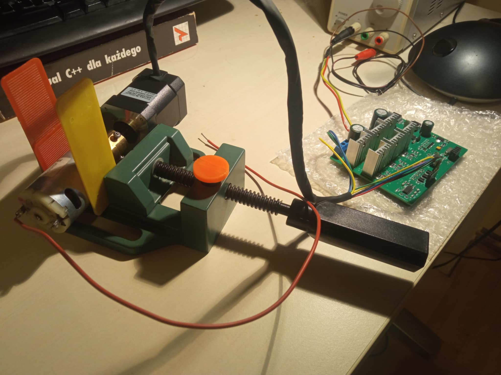

# BLDC_motor_controller

As part of this project, a BLDC motor controller was constructed and programmed.

Tests were conducted on a 24V/60W BLDC motor, with a DC motor used as the mechanical load, and its shaft was coupled to the shaft of the motor being tested.

